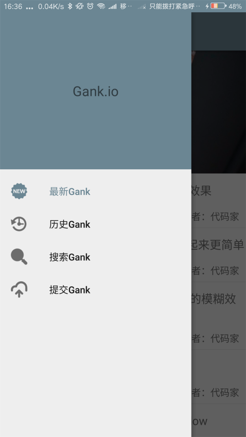
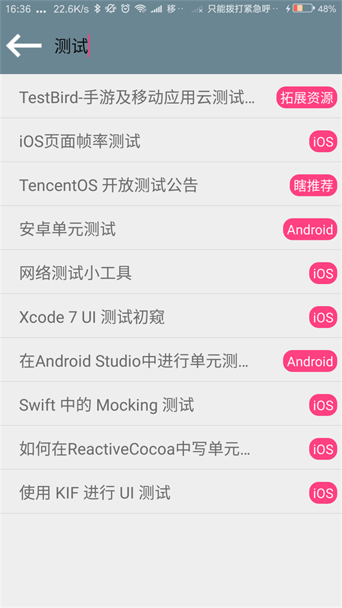

MVP+retrofit+rxJava实现的干货集中营[http://gank.io/](http://gank.io/)的Android客户端

仿照google官方推荐的写法：[https://github.com/googlesamples/android-architecture](https://github.com/googlesamples/android-architecture)

运行截图：

